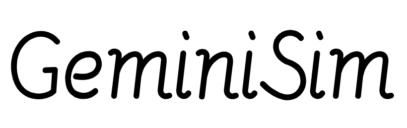

# GeminiSim

GeminiSim is a simple simulator for MIPS. 

I built the basic MIPS ISA into the simulator in software level (**NOT INCLUDE ALL FUNCTIONS OF MIPS** ~~because I'm lazy :P~~). 

Specially, I use [Gemini](https://github.com/Ellen7ions/Gemini) as CPU core which is a real hardware project running on FPGA. You can get more info about Gemini from my repo.

